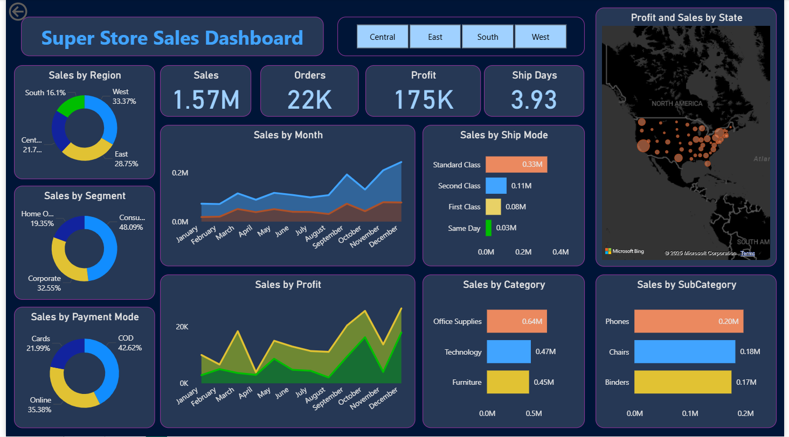

# Super Store Sales Dashboard 📊

This project is an **interactive Power BI dashboard** built to analyze the sales performance of a Super Store dataset. The dashboard provides insights into **sales, profit, orders, shipping, and customer segments** across different regions and categories.

---

## 📌 Features

- **Sales Overview**:
  - Total Sales: **1.57M**
  - Total Orders: **22K**
  - Total Profit: **175K**
  - Average Shipping Days: **3.93**

- **Sales Insights**:
  - Sales by **Region** (East, West, Central, South)
  - Sales by **Segment** (Consumer, Corporate, Home Office)
  - Sales by **Payment Mode** (COD, Cards, Online)
  - Sales and Profit by **Month**
  - Sales by **Shipping Mode** (Standard, Second Class, First Class, Same Day)
  - Sales by **Category** (Office Supplies, Technology, Furniture)
  - Sales by **Sub-Category** (Phones, Chairs, Binders, etc.)
  - **Geographical View**: Profit & Sales by State (Map View)

---

## 📊 Dashboard Preview  

---

## 🛠 Tools & Technologies Used

- **Power BI Desktop** – Data visualization and dashboard creation  
- **Excel / CSV Dataset** – Source of sales data  
- **DAX (Data Analysis Expressions)** – For calculated measures and KPIs  

---

## 🎯 Key Insights

- The **West region** contributes the highest sales (33.37%).  
- **Consumer segment** drives nearly half of the total sales (48.09%).  
- **Cash on Delivery (COD)** is the most used payment method (42.62%).  
- **Phones** generate the highest sub-category sales (0.20M).  
- Profits show a rising trend toward the year-end (November–December).  

---

## 🚀 How to Use

1. Download the `.pbix` file. 
2. Open with **Power BI Desktop**.  
3. Interact with filters (Region, Category, Sub-Category) to explore insights.  

---

## 📈 Applications

- Helps businesses track **sales & profit trends**.  
- Identifies **profitable customer segments**.  
- Supports decision-making in **inventory, shipping, and regional strategies**.  

---

✨ If you like this project, don’t forget to ⭐ the repository!
